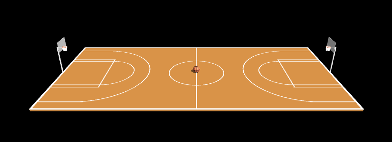
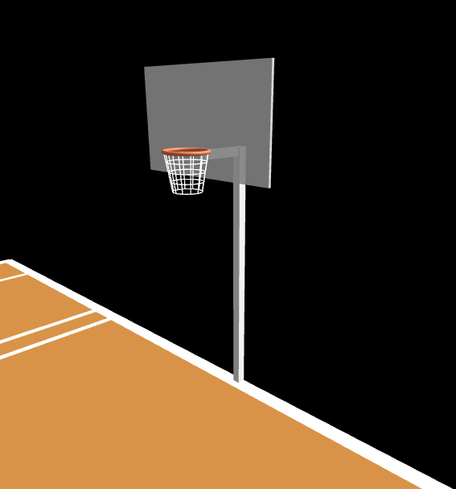
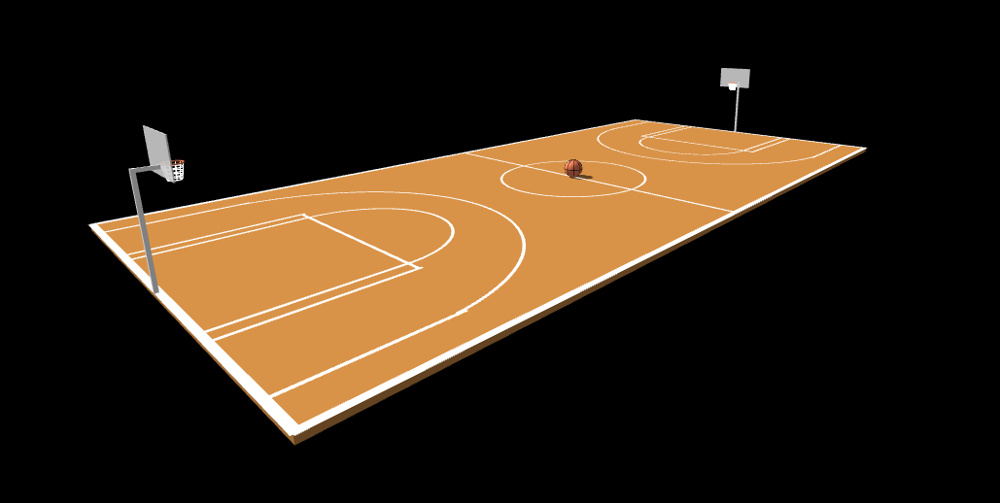

# Basketball Court - Computer Graphics HW5

## Group Members

- Dylan Lewis - 209722610
- Ziv Picciotto - 206919722

## Description

- Realistic basketball court with proper markings
- Two baskets with nets
- Basketball with texture
- Interactive camera controls

## How to Run

1. Clone this repository
2. Install dependencies: `npm install` (if using Node.js)
3. run `node index.js` and navigate to `http://localhost:8000/`
4. Use the controls below to interact with the scene

### Controls

- O: Toggle orbit camera
- Mouse drag: Rotate view
- Mouse scroll: Zoom in/out

## Additional Features

- Score tracking display
- Basket backboard frame
- Free throw lines

## External Assets

- Three.js library
- OrbitControls.js

## Screenshots

### Overall view

### Close-up view of basketball hoops

### View showing the basketball positioned at center court

### View Demonstrating Camera Controls

#### Previous pictures shows that the camera controls are working (dragging , rotating, zooming)

