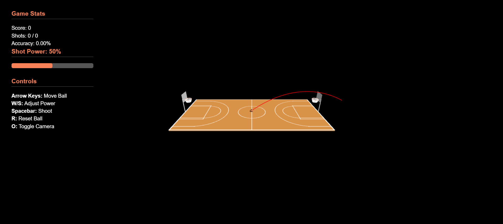
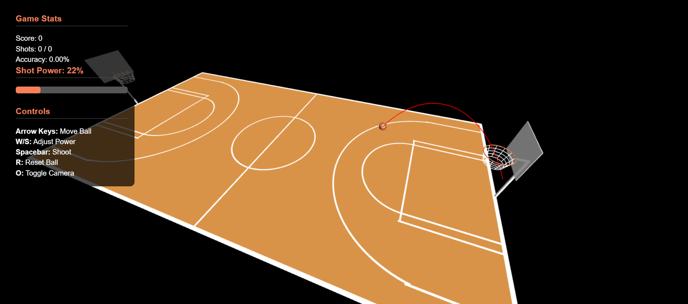
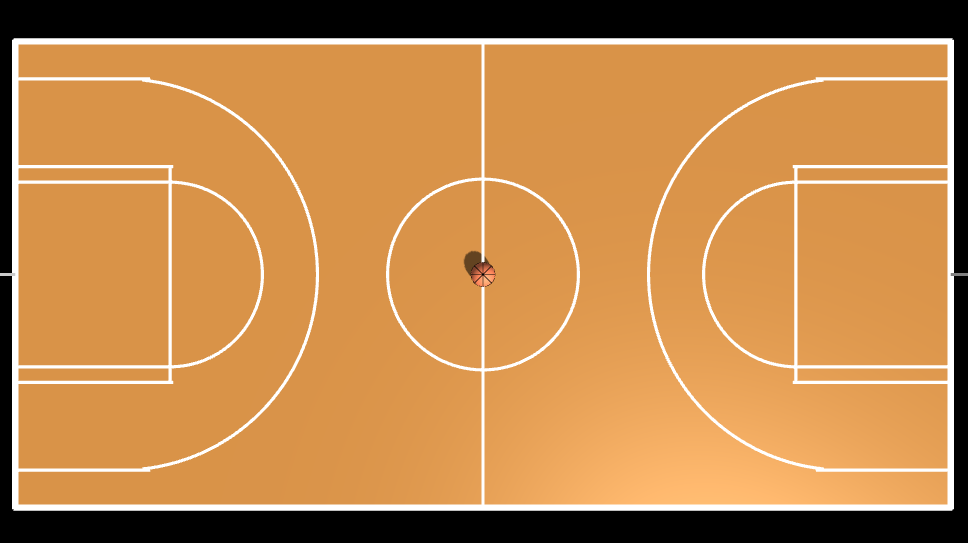
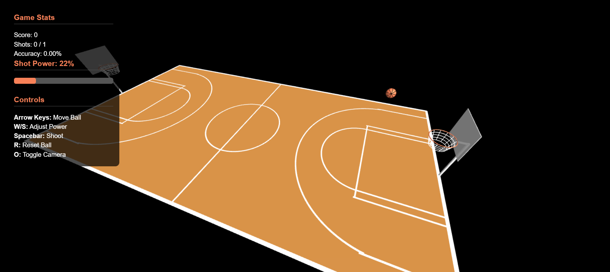

# Basketball Court - Computer Graphics HW5

## Group Members

- Dylan Lewis
- Ziv Picciotto

### ⚠️ STUDENT IDS ARE PROVIDED IN PDF SUBMISSION

## Description

- Realistic basketball court with proper markings
- Two baskets with nets
- Basketball with texture
- Interactive camera controls

## How to Run

1. Clone this repository
2. Install dependencies: `npm install` (if using Node.js)
3. run `node index.js` and navigate to `http://localhost:8000/`
4. Use the controls below to interact with the scene

### Controls

- O: Toggle orbit camera
- R: Reset ball
- W/S: Increase/Decrease shot power
- Arrow keys to move the ball
- Mouse drag: Rotate view
- Mouse scroll: Zoom in/out

## Additional Features

- Score tracking display
- Basket backboard frame
- Free throw lines

## External Assets

- Three.js library
- OrbitControls.js

# Physics System Implementation

The physics system uses a custom implementation with simplified Newtonian mechanics.

---

## 🔧 Key Components

### 🧲 Gravity

Constant acceleration applied to vertical velocity:

```javascript
ballVelocity.y += GRAVITY * delta;
```

Where `GRAVITY = -9.8` (m/s²)

---

### 🚀 Projectile Motion

- Initial velocity calculated from shot power and direction
- Separate horizontal and vertical components

```javascript
const initialSpeed = shotPower / 4;
const upwardForce = 7;
ballVelocity.copy(direction).multiplyScalar(initialSpeed);
ballVelocity.y += upwardForce;
```

---

### 💥 Collision Response

#### 🟫 Ground Collision

Velocity reversed and scaled by bounciness coefficient:

```javascript
ballVelocity.y *= -BALL_BOUNCINESS;
```

#### 🟢 Rim Collision

Direction-dependent bounce with spin effect:

```javascript
const spinPower = 0.5 * Math.sin(angleDiff);
ballVelocity.x += spinPower * horizontalVec.z;
ballVelocity.z -= spinPower * horizontalVec.x;
```

---

### 🧱 Collision Detection

#### 🧊 Custom Rim Collision

Uses cylinder math to detect contact:

```javascript
const rimContact =
  Math.abs(verticalDist) < ballRadius + rimThickness &&
  horizontalDist > rimHoleRadius - ballRadius &&
  horizontalDist < rimRadius + ballRadius;
```

---

### 🔮 Trajectory Prediction

Simulates the ball's flight path before actually shooting:

```javascript
for (let i = 0; i < 100; i++) {
  tempVelocity.y += GRAVITY * 0.016;
  tempPos.add(tempVelocity.clone().multiplyScalar(0.016));
}
```

## Screenshots

### Overall view



### Another view



### View showing the basketball positioned at center court



### Mid Shot Shot



# Link to video

https://youtu.be/SRM60QSEFUI
